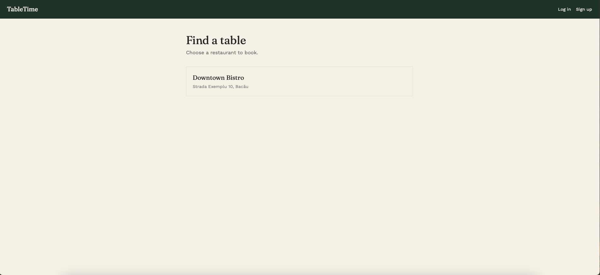
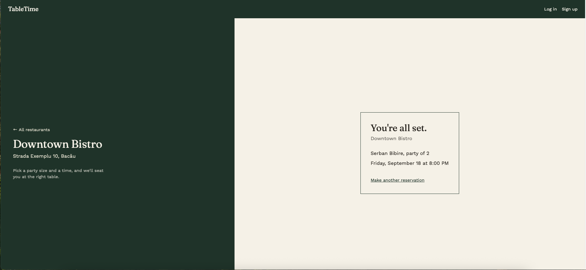
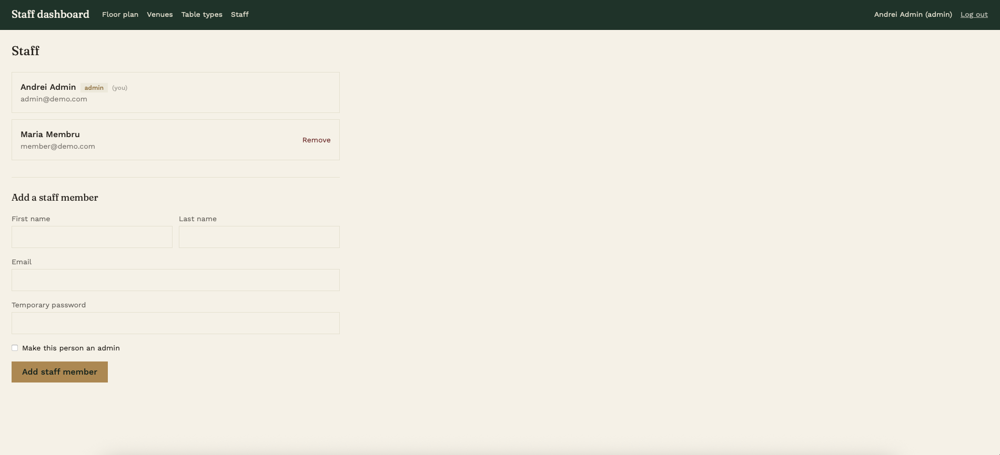

# TableTime — Restaurant Booking Platform (Frontend)

A two-sided booking platform: customers browse restaurants and reserve a table in a couple of clicks, while restaurant staff manage venues, floor plans, and see reservations at a glance. Built as the frontend for the [Restaurant Booking API](../../learning) — a separate backend project with JWT auth, multi-tenant data isolation, and automated tests.

**Live demo:** [restaurant-booking-frontend-five.vercel.app](https://restaurant-booking-frontend-five.vercel.app)
*(the backend runs on a free Render instance — the first request after a period of inactivity can take up to a minute to wake up)*

## Screenshots

### Customer: browse and book

| Find a restaurant | Reserve a table | Confirmation |
|---|---|---|
|  |  |  |

### Staff: floor plan and management

**Live floor plan** — tables update in real time based on existing bookings; click a booked table to see the reservation details.


**Staff management** — the account owner and admins can add or remove staff members.



## Features

**For customers**
- Browse every restaurant on the platform, no account required
- Book a table as a guest (name + phone), or create an account for faster checkout
- Register, log in, log out, change password
- Pick a party size and a time slot — the backend finds an available table automatically, no need to know the floor plan

**For restaurant staff**
- Self-service restaurant sign-up — creates the restaurant account and its first admin in one step
- Manage venues, areas, table types, and tables
- A live floor plan per area: tables are colored by availability for the selected date and time, with reservation details one click away
- Manage staff: add team members, promote to admin, remove access — the account owner can never be removed or demoted

## Stack

- React + TypeScript, built with Vite
- Tailwind CSS
- React Router (client-side routing for both the customer and staff areas, under one app)
- Plain `fetch` against the [Restaurant Booking API](../../learning)

## Getting started

**Requirements:** Node.js, and the [backend](../../learning) running (locally or deployed).

```bash
npm install
cp .env.example .env   # fill in the API URL
npm run dev
```

`.env`:
```
VITE_API_URL=http://localhost:3000
```

## Project structure

```
src/
  api/          — typed fetch wrappers for the backend (public, customers, staff)
  components/   — shared UI: layouts, the floor plan canvas, form pieces
  context/      — separate auth contexts for customers and staff (independent sessions)
  pages/        — one file per route
    staff/      — everything under /staff
```

## Design

Two-panel layout evoking a restaurant's reservation ledger rather than a generic SaaS form: deep forest green, warm ivory, a single brass accent. *Fraunces* for display type, *Work Sans* for everything else.
